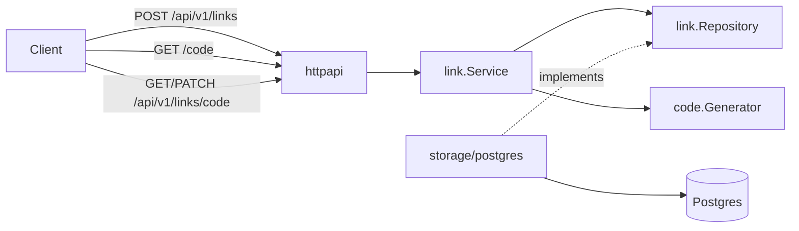

# Architecture

## Request flow

## Layers

| Layer | Package | Responsibility |
|---|---|---|
| Entrypoint | `cmd/server` | Config, pool, migrations, DI wiring, graceful shutdown |
| Transport | `internal/httpapi` | HTTP routing, JSON DTOs, Bearer parsing, status mapping |
| Application | `internal/link` | Create / redirect / metadata / deactivate use cases |
| Domain helpers | `internal/code` | Alias generation and URL/alias validation |
| Adapter | `internal/storage/postgres` | SQL, SQLSTATE mapping, goose migrations |

**Dependency rule**: `httpapi` → `link` ← `postgres`. Handlers never import `pgx`.

## Auth model

- No user accounts / login / JWT.
- On create, issue opaque Bearer capability token (`usk_…`), store **SHA-256 hash only**.
- `PATCH` deactivate and `GET .../analytics` require `Authorization: Bearer <token>`; verified with `subtle.ConstantTimeCompare`.
- Create, redirect, and metadata remain public by design.
- Each successful redirect records a `click_events` row (timestamp, referrer, user-agent) and increments `hit_count`.

## Redirect status

Successful redirects use **302 Found** because the hit counter is mutated; 301 would encourage aggressive caching of a side-effecting hop.
